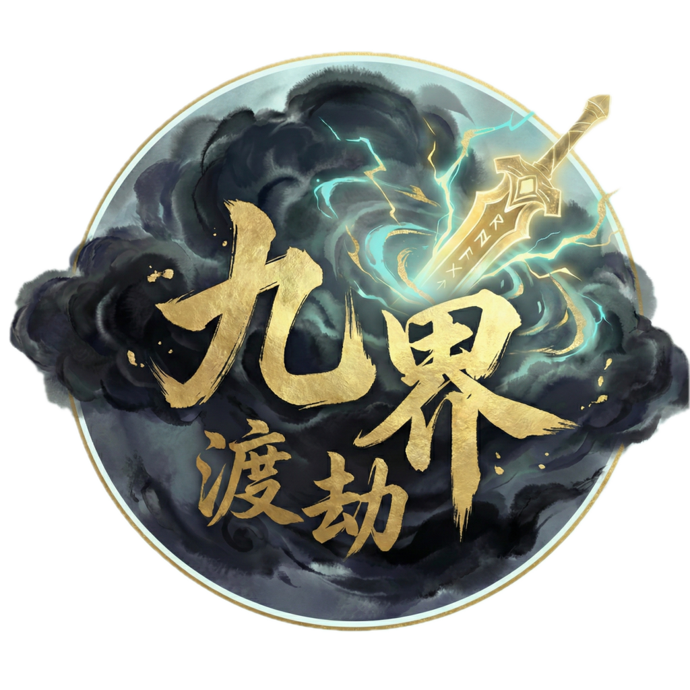

# 九界：渡劫 (JiuJie)

<p align="center">
  
</p>

[](https://bevyengine.org)
[](https://www.rust-lang.org)
[](LICENSE)
[](https://apps.microsoft.com/store/detail/9N2XV5GGRN98?cid=DevShareMCLPCS)

[English Version](./README_EN.md)

> **"身法如幻，惊雷裂空。在这场跨越九界的肉鸽渡劫之旅中，体验极致的打击感与视觉美学。"**

---

## 🎮 立即试玩 | Download & Play

您可以直接通过 Windows 商店免费下载试玩版：

[**👉 立即在 Microsoft Store 获取《九界：渡劫》**](https://apps.microsoft.com/store/detail/9N2XV5GGRN98?cid=DevShareMCLPCS)

---

## 📖 项目简介

《九界：渡劫》是一款基于 **Bevy Engine (Rust)** 开发的修仙肉鸽卡牌游戏。

这不仅仅是一个卡牌对战器，更是一个探索 3D 渲染极限的技术实验场。我们利用极简的纸片人美学，融合了 AAA 级的动态表现力，旨在利用 Rust 语言的卓越性能，创造出独一无二的“渡劫”感官体验。

---

## 🛠️ 核心技术黑科技 (Technical Showcase)

项目目前已集成多项顶级视觉与性能方案，所有逻辑均通过 15+ 轮 TDD（测试驱动开发）严苛验证，确保物理表现的真实与稳健。

### ⚡ 顶级视觉特效 (VFX V2)
- [x] **GPU 粒子全量加速**: 基于 `bevy_hanabi` 实现，支持万级粒子同屏爆发，CPU 物理计算零开销。
- [x] **电影级程序化闪电**: 采用递归中点位移算法，支持物理粗细渐变 (Tapering) 与路径中心纠偏，模拟真实雷电形态。
- [x] **身法残影系统**: 3D 姿态瞬间快照 (Snapshot)，支持初始 1.15x 能量膨胀与平滑动态扩张动画。
- [x] **GPU Ribbon 流光拖尾**: 随角色运动速度动态激活，呈现丝滑且具有发光质感的能量轨迹。
- [x] **HDR 加法混合材质**: 蓝白高能过载内核，彻底击穿重雾环境，无惧视觉灰化，确保特效刺眼夺目。

### 👊 打击感与时间系统 (Juice System)
- [x] **AAA 级顿帧系统**: 利用虚拟时间缩放，命中瞬间触发 0.3s 极度减速 (0.01x)，模拟真实的物理撞击阻力。
- [x] **全系统视觉联动**: 顿帧、高频闪屏、粒子过载与残影闪现在同一帧内同步爆发，形成强力反馈感。
- [x] **万剑归宗：智能寻敌**: 导弹式多目标自动分流算法，支持目标死亡后的瞬时航向修正，实现精准制导感。

### 🏗️ 工程架构
- [x] **VFX 编排器模式**: 逻辑逻辑与渲染彻底分离，支持复杂的四阶段特效状态机编排。
- [x] **无头化集成测试 (Headless)**: 完善的物理一致性验证集，支持在 CI 环境或 macOS 无头模式下全量运行。

---

## 🎮 视觉预览

<p align="center">
  <video src="https://github.com/user-attachments/assets/e7ad31af-04df-489d-903b-fdd1f234d12a" width="800" controls autoplay loop muted>
    您的浏览器不支持 HTML5 视频。
  </video>
</p>

> **[身法移动 - 流光拖尾与膨胀残影 | 万剑归宗 - 多目标智能打击]**

---

## 🚀 快速开始

### 环境依赖
*   Rust 1.80+
*   支持 WGPU 的主流显卡 (Nvidia/AMD/Apple Silicon)

### 构建与运行
```bash
# 克隆仓库
git clone https://github.com/peterfei/JiuJie.git
cd JiuJie

# 以 Release 模式运行以获得最佳性能
cargo run --release
```

---

## 📜 开发路线图 (Roadmap)
- [ ] 更多门派功法视觉重制（如：太阴、天蛇等身法特效）
- [ ] 基于 Shader 的全屏后期后期特效（径向模糊、色彩分离）
- [ ] 实时环境交互粒子系统

---

## 🤝 贡献与许可
欢迎提交 Issue 或 Pull Request 来共同打造最强 Bevy 特效库。
本项目采用 MIT 或 Apache-2.0 双协议许可。
